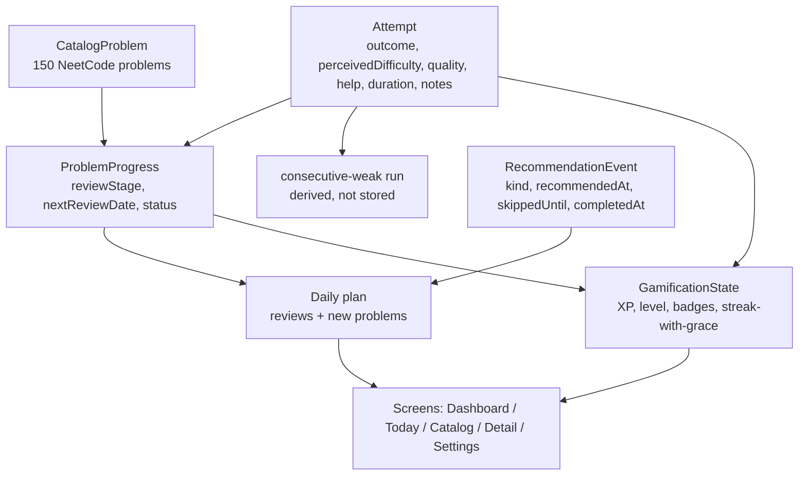

# PatternPilot — adaptive-coach fixes, catalog completion, and gamification

## 1. What we're building

PatternPilot is a local-first NeetCode 150 practice tracker (React + Dexie/IndexedDB,
no server). It recommends a small daily plan of new problems and spaced-repetition
reviews, records attempts, and shows progress.

This effort has five threads, in priority order:

1. **Fix double-counting of reviews.** Recording an attempt for the same problem
   twice in one calendar day — once from the daily plan, once from the catalog's
   Problem Detail form — advances its review stage twice and skips a spaced-repetition
   interval. Cap stage advancement at one attempt per problem per calendar day, and
   make the catalog attempt form also close a matching daily-plan recommendation.
2. **Fix the recommendation / mastery algorithm's blind spots.** A problem the user
   keeps failing resurfaces every single day forever, and its topic stays maximally
   prioritized so the user is fed *more* new problems from the topic they are failing.
   There is no "am I actually mastering this" signal and no handling of a user who
   returns after a few days away (the streak resets to zero, punishing the gap).
3. **Review the attempt form's data capture.** Confirm the form already extracts
   enough signal (it does — `outcome`, `perceivedDifficulty`, `helpType`, `duration`,
   `notes`). Do **not** add fields. Make the labels and option copy more
   human-readable, adapt the difficulty and help-type options to the chosen
   outcome so only sensible combinations are offered (see §2), and surface the
   already-captured-but-unused fields.
4. **Confirm the catalog is the full NeetCode 150.** It already is (150 problems,
   all 18 topics). This thread is a verification + a stale-seed-safety note, not a
   build.
5. **Add a gamification layer.** XP, levels, streak with grace days, milestone
   badges, a topic-mastery visual, and tasteful CSS/SVG animation (geometry motifs),
   all dependency-free on the existing token system, respecting
   `prefers-reduced-motion`.

Plus a **project restructure** to align the tree with the documented architecture
(`docs/AGENTS.md` names `services/`; the repo had `domain/` — renamed in PR 1) and
to give the growing rules layer clearer seams.

### Core concepts



### What could be removed from scope

- Configurable gamification (difficulty of XP curve, toggles) — ship one fixed,
  well-tuned curve.
- A separate "mastery score" stored column — derive stuck/mastery signals from the
  existing `attempts` table (`problemId` + `quality` + `attemptedOn`).
- Per-problem "park / snooze until I'm ready" UI — the de-escalation rule (thread 2)
  handles the failing-problem case automatically; a manual park can be a later add.

## 2. User experience

### Happy flow (unchanged shape, better feedback)

Open **Today** → 2–4 items (≥1 new). Solve on LeetCode → return → "Log attempt" →
pick outcome + perceived difficulty (+ help type if used) → save. The item shows
"Solved", XP animates up, and if a threshold is crossed a badge/level-up flourish
plays once.

### Alternative and failure flows

- **Same problem, two entry points, one day.** User logs an attempt from Today,
  then opens the same problem in the Catalog and logs another (e.g. a second
  practice pass). Both `Attempt` rows are kept (history is honest), but
  `ProblemProgress.reviewStage` / `nextReviewDate` only move on the **first**
  attempt of that calendar day. The catalog save also marks the Today item
  complete if one is open.
- **A problem the user keeps failing.** After N consecutive weak attempts on one
  problem (default 3), it is *de-escalated*: `nextReviewDate` backs off on a
  gentle curve (2 → 4 → 7 days) instead of returning tomorrow forever, the
  problem is flagged `struggling`, and its topic's mastery denominator no longer
  treats it as a live "unmastered, needs new problems" signal. The dashboard
  surfaces a "Needs a different approach" nudge for that problem (link to
  NeetCode walkthrough).
- **User returns after 3 days away.** Streak is not reset to 0 on the first gap.
  A **grace day** allowance (1 per 7 active days, capped at 1 — see §3) absorbs a
  single missed day; two or more consecutive misses with no grace left reset it.
  Grace usage is re-derived from the active-date history on every read, so the
  streak calculation is idempotent — the persisted state is the allowance, never
  a spent-down balance. Due reviews
  that piled up are drained via the existing review-slot scaling (up to 3/day),
  weakest-quality first, so the backlog clears without a 15-item wall.
- **No eligible new problem** (all topics mastered / solved): plan shows reviews
  only, with a "You've worked through the catalog" state.
- **Reduced motion:** all XP/level/badge animation collapses to instant state
  changes; no parallax, no confetti.

### Information architecture changes

- **Dashboard** gains: a level/XP header strip, streak with a "grace day used"
  indicator, a topic-mastery visual (constellation / bar grid), and a
  "Needs attention" list (struggling problems).
- **Today** items show XP value per item and a subtle completion animation.
- **Catalog / Problem Detail**: attempt form copy is reworded and its options
  adapt to the outcome (`solved_independently` → all difficulties, no help type;
  `solved_with_hint` → manageable/hard + shallow help types; `watched_solution` /
  `could_not_solve` → no difficulty field, deeper/no help types). Both the catalog
  list and Problem Detail render the problem's status and difficulty as prominent
  badges; Problem Detail shows the full attempt history with the now-surfaced
  fields (help type, duration, notes) and a `struggling` badge when set.
- New optional **Achievements** panel (within Dashboard or Settings) listing earned
  and locked badges.

## 3. Technical needs

### Data model changes (Dexie `version(2)` + `BackupPayload` `formatVersion: 2`)

**`ProblemProgress`** — add:

| Field | Type | Meaning |
|---|---|---|
| `consecutiveWeak` | `number` | count of back-to-back weak attempts; resets on any non-weak |
| `struggling` | `boolean` | set once `consecutiveWeak >= STRUGGLE_THRESHOLD`; cleared on a strong attempt |

**Once-per-day stage guard — no new column.** Derive it: does an `Attempt` row
already exist for this `problemId` + `attemptedOn`? `saveAttempt` reads that inside
its existing transaction before writing. This survives out-of-order backdating,
which a stored "last advance date" would not.

**New `settings` keys** for streak-cadence state (review-cadence, not gamification —
so the streak can be wired without the gamification store): `streakGraceRemaining`,
`streakGraceRefreshedOn`, `lastActiveOn`. Written lazily on first update; the
reader defaults when they are absent, so nothing has to seed them and a reset /
v1 restore does not break the streak.

**New store `gamification`** (single row, `key: 'state'`, added in Dexie
`version(3)` — see below):

```ts
interface GamificationState {
  key: 'state';
  xp: number;                 // total lifetime XP
  level: number;              // derived but cached for cheap reads
  badges: string[];           // earned badge ids
  streakGraceRemaining: number;
  streakGraceRefreshedOn: string; // YYYY-MM-DD
  lastActiveOn: string | null;    // YYYY-MM-DD
  updatedAt: string;
}
```

**Dexie migrations:**
- `db.version(2)...upgrade()` — backfills `consecutiveWeak: 0`, `struggling: false`
  on existing `progress` rows. The streak `settings` rows are **not** seeded here —
  they are written lazily on first update and the reader defaults when they are
  absent, so a reset or a v1 restore (neither re-runs this upgrade) still works.
  Ships in the coach-fixes PR.
- `db.version(3).stores({ gamification: '&key', ... }).upgrade()` — creates the
  `gamification` store and replays lifetime XP from historical `attempts`. **Must
  be a separate version:** Dexie will not re-run a `version(2)` upgrade for a user
  who already opened a v2 build. Ships in the gamification PR.

**Backup back-compat:** `validateBackupPayload` accepts `formatVersion` 1 **or** 2.
A v1 file restores with the new fields defaulted (same backfill as the migration).
Gamification data is **optional** in a v2 payload — a v2 backup from a
coach-fixes-era build has none, and the gamification-era validator must still
accept it. Export writes v2.

### Key algorithms

**Once-per-day stage guard** (`src/services/reviews.ts` + `src/db/saveAttempt.ts`):
no stored column. Inside `saveAttempt`'s transaction, check whether an `Attempt`
row already exists for this `problemId` + `attemptedOn`; pass the result as
`alreadyAttemptedToday` to `progressAfterAttempt`. When true, keep `reviewStage` /
`nextReviewDate` unchanged; still update `lastQuality`, `lastAttemptDate`,
`consecutiveWeak`, `struggling`, `strongAttemptCount`. This is correct under
out-of-order backdating, which a stored "last advance date" is not.

**De-escalation of a struggling problem** (`reviews.ts` + `dailyPlan.ts`):
- `consecutiveWeak` increments on each weak attempt, resets to 0 otherwise.
- The review backoff keys on the **current** `consecutiveWeak`, not the sticky
  `struggling` flag: a weak attempt with `consecutiveWeak >= 3` schedules the next
  review on the `[2, 4, 7]`-day ladder (indexed by `min(consecutiveWeak - 3, 2)`)
  instead of the flat "tomorrow". A non-weak attempt resets `consecutiveWeak`, so
  the next weak attempt after a partial goes back to "tomorrow" and has to climb
  the run again — the flag stays set but does not by itself keep the review
  backed off.
- `struggling` is set once `consecutiveWeak >= 3` and only cleared by a strong
  attempt; a partial stops the run without clearing it.
- `topicMastery` in `dailyPlan.ts` takes a `forPriority` flag. For the
  new-problem **topic pick**, a `struggling` problem counts as a neutral 0.5 so
  the engine stops flooding the user with new problems from a topic they're stuck
  in. For the **difficulty ceiling** it counts as its real (reset-to-0) stage, so
  a topic the user is failing does not unlock Medium/Hard.

**Mastery / "is it helping" signal** (new pure module
`src/services/mastery.ts`, all derived from `attempts` + `progress`, no new storage):
- `topicTrajectory(topic, attempts, problems)` → `'improving' | 'flat' | 'declining'`
  from the sequence of qualities in that topic over the last ~10 attempts.
- `strugglingProblems(progress)` → list where `struggling`.
- Feeds the Dashboard "Needs attention" list and (optionally) a gentle topic
  ordering nudge.

**Streak with grace days** (`src/services/streak.ts`, extracted + extended from
`Dashboard.tsx`'s inline `currentStreak`):
- Walk back from today over the set of active dates (dates with ≥1 attempt).
- On a missing date, spend one grace day (if any remain and the streak has
  started) and continue; when grace is exhausted, stop.
- The grace allowance refreshes to `STREAK_GRACE_PER_WEEK` (default 1, and
  capped there) once per rolling 7 active days, tracked by `streakGraceRefreshedOn`.
- Pure function takes `(activeDates, graceState, today)` and returns
  `{ streak, graceDaysUsed, graceState }`. **`graceState` in the result is the
  refreshed allowance, not a spent-down balance** — grace consumption is
  re-derived from `activeDates` every call, so the function is idempotent and the
  Dashboard can persist `graceState` on every render without corrupting the
  streak. `graceDaysUsed` is for display only. The Dexie read/write of
  `graceState` lives in `db/`; when the `settings` rows are absent the reader
  defaults to `{ graceRemaining: STREAK_GRACE_PER_WEEK, graceRefreshedOn: '' }`.

**XP + levels** (`src/services/gamification.ts`, pure):
- `xpForAttempt(quality, kind, isFirstOfDay)` → e.g. strong 20 / partial 12 /
  weak 5; review ×1.0, new ×1.25; second-same-day pass ×0.25.
- `levelForXp(xp)` → gentle curve, e.g. `level = floor(sqrt(xp / 50))`.
- `badgesEarned(state, progress, attempts)` → pure check of badge predicates
  (first mastered problem, a topic fully mastered, 7-day streak, 30-day streak,
  100 problems attempted, a full tier mastered, …). Returns ids; caller diffs
  against `state.badges` to fire the "new badge" animation.

### Module / folder structure (restructure)

Rename `src/domain/` → `src/services/` to match `docs/AGENTS.md`, and split by
concern. Target tree:

```
src/
  data/            catalog.ts, neetcode150.json, topicTiers.ts        (unchanged)
  db/              database.ts, seedCatalog.ts, saveAttempt.ts,
                   recommendations.ts, backup.ts, gamification.ts (new: Dexie I/O)
  services/        reviews.ts, dailyPlan.ts, mastery.ts (new),
                   streak.ts (new), gamification.ts (new: pure rules),
                   constants.ts (new: thresholds)
  components/      + GamificationBar.tsx, TopicConstellation.tsx,
                   BadgeShelf.tsx, NeedsAttention.tsx
  hooks/           useGamification.ts (new), useDailyPlan.ts (extract from App.tsx)
  types/           models.ts                                          (extended)
  styles/          global.css + gamification.css (new, @imported)
```

`db/gamification.ts` and `services/gamification.ts` share a name across layers
(I/O vs pure) mirroring the existing `db/recommendations.ts` split — acceptable,
but if it reads badly, name the service `services/scoring.ts`.

All new rule modules are **pure functions**, no classes, unit-tested, deterministic
(per `docs/AGENTS.md`). Thresholds (`STRUGGLE_THRESHOLD`, backoff ladder,
`STREAK_GRACE_PER_WEEK`, XP table, level curve) live in one `constants.ts` so they
are tunable and visible.

### Edge cases

- Backdated / out-of-order attempts: the guard asks "is there already an `Attempt`
  for this `problemId` + `attemptedOn`?", so logging today then backdating one to
  last week advances the stage for each distinct day and never re-opens a day.
- Migration run twice / interrupted: each `upgrade` is idempotent (checks field /
  store presence).
- Empty `attempts` on first launch: XP replay yields 0, level 1, no badges — fine.
- Grace-day clock and DST: all date math stays on `YYYY-MM-DD` local strings, as
  the rest of the app does.
- A v2 backup restored into an older build: `formatVersion` mismatch → existing
  "not a valid backup" error (acceptable; documented).
- `prefers-reduced-motion`: gate every new `@keyframes` behind the existing media
  query already in `global.css:149`.

## 4. Testing and security

### Tests (Vitest, `*.test.ts`)

- **`reviews.test.ts`** (extend): once-per-day guard — `alreadyAttemptedToday`
  freezes the stage; different dates advance; **backdated attempt after a
  same-day one does not re-advance**; `consecutiveWeak` / `struggling` transitions;
  backoff ladder dates; strong attempt clears `struggling`.
- **`dailyPlan.test.ts` / `dailyPlanSimulation.test.ts`** (extend): a problem
  driven to 3+ weak attempts stops flooding its topic with new problems; the
  struggling problem's `nextReviewDate` backs off; over a 30-day sim a "user with
  a persistent blind-spot topic" still gets breadth elsewhere. Re-assert the
  existing 6 simulation invariants still hold.
- **`streak.test.ts`** (new): grace day absorbs a 1-day gap; two gaps with grace 1
  resets; grace refresh after 7 active days; returning-after-3-days scenario;
  feeding the returned `graceState` back in is idempotent (no double-spend).
- **`gamification.test.ts`** (new): XP per outcome/kind/first-of-day; level curve
  monotonic and hits expected breakpoints; each badge predicate fires exactly at
  its condition and not before; `badgesEarned` is idempotent.
- **`mastery.test.ts`** (new): trajectory classification on improving / flat /
  declining quality sequences; `strugglingProblems` filter.
- **`backup.test.ts`** (extend): v1 file restores with defaults; v2 round-trips;
  export is always v2; migration backfill matches restore backfill.
- **Migration tests**: seed a fake v1 DB → open at v2 → assert `progress` fields
  backfilled (streak `settings` rows are not seeded — the reader defaults).
  Separately: v2 DB → open at v3 → assert `gamification` store created with XP
  replayed from `attempts`.

### Side effects on existing behavior

- `progressAfterAttempt` gains an `alreadyAttemptedToday: boolean` param and returns
  the new fields — all callers are `saveAttempt.ts` and tests.
- `Dashboard.tsx` inline `currentStreak` is removed in favour of `services/streak.ts`
  — visual output must match for the no-gap case (existing QA item).
- `App.tsx` daily-plan wiring moves into `hooks/useDailyPlan.ts` — behaviour
  identical, verified by the daily-plan tests + manual QA.
- `docs/SPEC.md`, `docs/SCHEMA.md`, `docs/MILESTONES.md`, `docs/QA.md` all need
  updates (see §6).

### Security

Not applicable in the classic sense — local-only, no server, no auth, no secrets,
no network calls, no user-supplied code. Input validation already exists on the
attempt form and backup restore; the new backup fields get the same
`validateBackupPayload` type-guards. No new attack surface.

## 5. Plan of work

Delivered as **sequential PRs off `master`**, each green under `npm run verify`.
The authoritative PR-by-PR sequence, file list, and end-to-end verification steps
live in the implementation plan at
`~/.claude/plans/i-was-to-add-merry-conway.md` — this section is the summary.

- **PR 0** — merge the already-open adaptive-daily-plan PR (#3): every later PR
  builds on `topicTiers.ts` + the adaptive `dailyPlan.ts` it introduces.
- **PR 1** — repo hygiene: commit the `plan/` → `docs/` rename, `git mv src/domain
  src/services` + import updates, fix the stale `plan/SPEC.md` ref, add this doc.
  No behaviour change.
- **PR 2** — recommendation & mastery fixes + schema: `ProblemProgress` gains
  `consecutiveWeak` / `struggling`; Dexie `version(2)` + `BackupPayload`
  `formatVersion: 2`; once-per-day stage/status guard (derived from the `attempts`
  table, no new column); struggling-problem de-escalation ladder; `topicMastery`
  takes a `forPriority` flag so struggling problems relieve new-problem topic
  pressure (count as 0.5) without lifting the difficulty ceiling (count as their
  real 0); new pure `mastery.ts`, `streak.ts`, `constants.ts`. All 6 tuned
  simulation invariants stay green, plus a new blind-spot scenario that also
  asserts the ceiling does not rise.
- **PR 3** — catalog-entry review completion (saving an attempt from Problem Detail
  also completes a matching open daily item) + attempt-form copy rewording (labels
  only, enum values unchanged) + surfacing `helpType` / `durationMinutes` / `notes`
  / `struggling` in the attempt history.
- **PR 4** — `App.tsx` decomposition (`hooks/useDailyPlan.ts`) + wire
  `services/streak.ts` with grace days into the Dashboard.
- **PR 5** — gamification: `db/gamification.ts` (I/O) + `services/gamification.ts`
  (pure XP/levels/badges) + `hooks/useGamification.ts`; Dexie **`version(3)`**
  adds the `gamification` store and replays lifetime XP from `attempts` (must be a
  new version — Dexie won't re-run a v2 upgrade for an existing v2 user);
  `GamificationBar` / `TopicConstellation` / `BadgeShelf` / `NeedsAttention`
  components; `styles/gamification.css` with CSS/SVG geometry animation, all behind
  `prefers-reduced-motion`.

### Definition of Done (overall)
- **Required:** PRs 0–3 (correctness). PR 4 (aligns with documented architecture).
- **Deferrable:** PR 5 gamification can ship in slices (XP+level, then badges, then
  constellation) if time-boxed.

## 6. Ripple effects

- **`docs/SPEC.md`** — document: once-per-day stage cap, struggling-problem
  de-escalation, streak grace days, XP/levels/badges, the two review entry points.
- **`docs/SCHEMA.md`** — new `ProblemProgress` fields, streak `settings` rows,
  `gamification` store, `BackupPayload` `formatVersion: 2`, Dexie `version(2)`
  (progress + streak) and `version(3)` (gamification + XP replay).
- **`docs/MILESTONES.md`** — add milestones 6 (coach fixes) and 7 (gamification).
- **`docs/QA.md`** — new manual cases: two-entry-point review, de-escalation,
  streak grace, XP/badge/reduced-motion, v1→v2 restore.
- **`docs/AGENTS.md`** — folder list already says `services/`; PR 1 makes the code
  match; note the derived-signal rule (no new columns for mastery).
- **`CLAUDE.md`** — none exists; a follow-up (confirm with the owner first, per the
  new-project checklist) should add one plus a `PostToolUse` lint/typecheck hook in
  `.claude/settings.json`.
- **Users:** solo user (the repo owner) — the changelog in PR bodies is enough.
- **External systems:** none (no analytics, payments, email, CI beyond local
  `npm run verify`).
- **`.hallmark/`** — design-token provenance file; update `motion` note if the
  gamification CSS establishes a real motion vocabulary.

## 7. Broader context

### Known limitations of this design

- **Grace-day model is a heuristic.** "1 per 7 active days" is a guess; it may feel
  too stingy or too loose. It's a single constant, tunable after use.
- **XP replay on migration** reconstructs lifetime XP from `attempts` but not
  historical streak grace or badge-unlock *timing* — returning users get their
  badges all at once with no animation. Acceptable one-time cost.
- **`struggling` is per-problem, not per-pattern.** A user weak on "sliding window"
  as a technique but who happens to pass one easy instance won't be flagged at the
  topic level beyond the `topicTrajectory` nudge.
- **No difficulty signal from `durationMinutes`.** It's surfaced but still not fed
  into the algorithm; a future version could use "took 3× the median for this
  difficulty" as a soft-weak signal.
- **Gamification is single-player, local.** No leaderboards, no sync — by design
  (`docs/AGENTS.md`: no server).

### Plausible future extensions

- Manual "park this problem" / "I want to focus on topic X this week" controls.
- Pattern-level (not just problem-level) mastery tracking.
- A weekly review digest screen.
- Import a LeetCode submissions export to backfill history.

### Moonshots

- On-device spaced-repetition tuning: fit the interval ladder to the individual
  user's forgetting curve from their own review outcomes.
- A generative "hint ladder" per problem stored locally (would need an AI dep —
  currently disallowed by `docs/AGENTS.md`).
