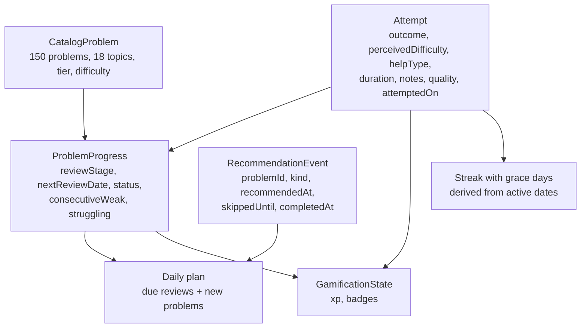

# The adaptive coach and gamification algorithm

This document describes how PatternPilot decides what to recommend, how it scores
practice, and how the two interact. It is a specification of the current
behaviour, not a change log. Prose behaviour lives in `../SPEC.md`; the data model
lives in `../SCHEMA.md`; every tunable constant referenced here lives in
`src/services/constants.ts`.

All the rules below are pure, deterministic functions in `src/services/`. They
take the current date as an argument (never read the wall clock) and are unit
tested. `src/db/` calls them and persists the results.

## 1. Entities



- **`CatalogProblem`** — static. `id`, `title`, `slug`, `leetcodeUrl`,
  `difficulty` (`easy` / `medium` / `hard`), `primaryTopic`, `neetcodeOrder`.
  The 150 problems span 18 topics. Each topic has a **tier** (`src/data/topicTiers.ts`):
  tier 1 = common foundations, tier 2 = core intermediate, tier 3 = niche/advanced.
- **`Attempt`** — one recorded practice session. `problemId`, `attemptedOn` (a
  `YYYY-MM-DD` local date), `createdAt` (ISO timestamp), `outcome`,
  `perceivedDifficulty`, `helpType`, `durationMinutes`, `notes`, and a derived
  `quality`. Append-only.
- **`ProblemProgress`** — one row per attempted problem. `reviewStage` (0–5),
  `nextReviewDate` (`YYYY-MM-DD` or `null`), `status`
  (`not_started` / `attempted` / `solved` / `mastered`), `lastQuality`,
  `lastAttemptDate`, `strongAttemptCount`, `consecutiveWeak`, `struggling`.
- **`RecommendationEvent`** — one row per problem placed on a daily plan.
  `kind` (`new` / `review`), `recommendedAt`, `skippedUntil` (or `null`),
  `completedAt` (or `null`).
- **`GamificationState`** — a single row. `xp` (lifetime total) and an optional
  `badges: string[]`. Level is not stored (§6).

## 2. Attempt quality

Each attempt's `quality` is derived from its `outcome` and `perceivedDifficulty`
(`qualityFor` in `src/services/reviews.ts`):

| outcome | perceived difficulty | quality |
|---|---|---|
| `solved_independently` | `easy` or `manageable` | `strong` |
| `solved_independently` | `hard` | `partial` |
| `solved_with_hint` | (any) | `partial` |
| `watched_solution` | — | `weak` |
| `could_not_solve` | — | `weak` |
| `skipped` | — | no attempt recorded |

The attempt form offers only the sensible field combinations for each outcome
(`src/services/attemptForm.ts`): `solved_with_hint` requires a shallow help type
(`small_hint` / `pattern_identification` / `pseudocode`); `watched_solution`
requires a deeper one (`pseudocode` / `full_code` / `solution_video`) and hides
the difficulty field (saved as `hard`); `could_not_solve` hides both. `skipped`
records no `Attempt` and instead sets the matching recommendation's `skippedUntil`
to 24 hours out.

## 3. Review scheduling (spaced repetition)

`progressAfterAttempt` (`src/services/reviews.ts`) computes the next
`ProblemProgress` from the previous one plus the new attempt's quality.

### 3.1 Stage and interval

`reviewStage` starts at 0. Per attempt:

| quality | new stage | next review |
|---|---|---|
| `strong` | `min(previous + 1, 5)` | by stage (below) |
| `partial` | `1` | 3 days |
| `weak` | `0` | 1 day (or the struggling ladder, §4) |

Interval by stage after a strong attempt: stage 1 → 3 days, 2 → 7, 3 → 14,
4 → 30, 5 → no next review. A problem at stage 5 has `status: 'mastered'`.

`status` is `mastered` at stage 5, `attempted` after a weak attempt, `solved`
otherwise.

### 3.2 The once-per-day guard

If an `Attempt` already exists for the same `problemId` on the same `attemptedOn`
(checked inside `saveAttempt`'s transaction, passed in as `alreadyAttemptedToday`),
the second attempt is **reinforcement only**: `reviewStage`, `nextReviewDate`, and
`status` are frozen at their current values. The softer signals — `lastQuality`,
`lastAttemptDate`, `consecutiveWeak`, `struggling`, `strongAttemptCount` — still
update.

This prevents logging the same problem twice in one day (once from the daily
plan, once from the catalog) from advancing the stage twice and skipping an
interval. It is derived from the `attempts` table rather than a stored
"last advanced on" column, so it stays correct when attempts are backdated or
entered out of order: each distinct `(problemId, attemptedOn)` day advances the
stage exactly once, in `createdAt` order.

## 4. Struggling problems

A weak attempt increments `consecutiveWeak`; any non-weak attempt resets it to 0.

- **`struggling` flag** — set once `consecutiveWeak >= STRUGGLE_THRESHOLD` (3).
  Cleared only by a `strong` attempt. A `partial` attempt stops the weak run
  (resets `consecutiveWeak`) but leaves the flag set.
- **Review back-off** — keyed on the *current* `consecutiveWeak`, not the sticky
  flag. When `consecutiveWeak >= 3`, a weak attempt schedules the next review on
  the `STRUGGLE_BACKOFF_DAYS` ladder `[2, 4, 7]`, indexed by
  `min(consecutiveWeak - 3, 2)` — so the 3rd consecutive weak → 2 days, 4th → 4,
  5th and beyond → 7. A non-weak attempt resets the run, so the next weak attempt
  after a `partial` starts again from 1 day and has to climb the ladder again.
- **New-problem topic pressure** — see §5.2. A struggling problem contributes a
  neutral 0.5 to its topic's mastery for the topic-selection score (so the topic
  stops being pinned at maximum priority and flooding the user with more problems
  from an area they are stuck in), but its real reset-to-0 stage for the
  difficulty ceiling (so a topic being failed never unlocks Medium/Hard).

## 5. The daily plan

`selectDailyPlan` (`src/services/dailyPlan.ts`) returns 2–4 items, always
including at least one new problem.

### 5.1 Slot allocation

Let `d` = the number of problems whose `nextReviewDate` is today or earlier
(excluding problems whose recommendation `skippedUntil` is still in the future):

| due reviews `d` | review slots | new slots |
|---|---|---|
| 0 | 0 | 2 |
| 1–2 | 1 | 2 |
| 3–5 | 2 | 1 |
| ≥ 6 | 3 | 1 |

Due reviews are ordered by weakest `lastQuality` first (`weak` < `partial` <
`strong`), then earliest `nextReviewDate`, then `neetcodeOrder`. Reviews beyond
the review slots wait for a later day and are counted in the dashboard's
"Due reviews" figure.

### 5.2 New-problem selection

New problems exclude anything `solved` or `mastered`. Selection is two-stage:
pick a topic, then pick a problem within it.

**Topic score** — for each topic with at least one eligible problem:

```
priority = tierWeight(topic) × (1 − mastery) × recencyPenalty + jitter
```

- `tierWeight` — 1.0 / 0.6 / 0.35 for tier 1 / 2 / 3. Common foundations outrank
  niche topics.
- `mastery` — mean of `reviewStage ÷ 5` across the topic's problems (untouched
  problems count as 0). A struggling problem counts as 0.5 here (§4). A topic the
  user is progressing through fades; a topic that goes badly (weak attempts reset
  stages) climbs back up.
- `recencyPenalty` — 0.35 if the topic was used by a `new` recommendation in the
  last two distinct calendar days, or is already used earlier in today's plan;
  otherwise 1.0.
- `jitter` — a small deterministic per-day, per-topic value in `[0, 0.05)` that
  breaks fixed ordering while staying stable within a single day (the same-day
  replay, §5.3, depends on the plan being reproducible).

The highest-priority topic wins. A fully mastered topic scores 0 and drops out.

**Problem within the topic** — the difficulty ceiling follows the topic's mastery,
computed with struggling problems at their real stage: Easy below 0.2, up to
Medium below 0.5, up to Hard at 0.5 and above. The easiest unsolved problem at or
below the ceiling is chosen, ordered by official difficulty then `neetcodeOrder`.
If the topic has nothing at or below the ceiling, its easiest unsolved problem is
chosen anyway.

This repeats until the new-slot target is filled, excluding already-chosen
problems and de-prioritising already-chosen topics via `recencyPenalty` on each
pass.

### 5.3 Same-day stability

Once any `RecommendationEvent` has been persisted for today, the plan replays
those stored items instead of re-selecting, so it does not shuffle as the user
records attempts through the day. It only tops up **new** problems if the stored
set has fewer than the current new-slot target. A skipped item stays hidden until
24 hours after its `skippedUntil` timestamp.

### 5.4 Recommendation completion

Recording an attempt for a problem that has an open (`completedAt: null`)
recommendation today sets that recommendation's `completedAt`, from either entry
point — the daily plan's feedback form or the catalog's problem detail form. This
is the sole writer of `completedAt` and is `kind`-agnostic
(`openRecommendationsToComplete` in `src/db/recommendations.ts`).

## 6. XP and levels

`src/services/gamification.ts`, pure. XP is awarded inside `saveAttempt`'s
transaction, atomically with the attempt and progress writes.

**`xpForAttempt(quality, isFirstOfDay)`**:

| quality | first attempt of the day | later same-day attempt |
|---|---|---|
| `strong` | 20 | 5 |
| `partial` | 12 | 3 |
| `weak` | 5 | 1 |

The same-day figure is `round(base × 0.25)`. `isFirstOfDay` is the negation of the
once-per-day guard (§3.2).

There is **no new-vs-review multiplier**. `kind` lives on `RecommendationEvent`,
not `Attempt`, and an attempt logged from the catalog with no open recommendation
has no `kind` at all — so a replay from the `attempts` table could not reconstruct
it, and the live award and the replay would disagree. Both inputs to the XP
formula (`quality`, first-of-day) *are* reconstructible from a stored `Attempt`
row, which is what makes §6.1 possible.

**`levelForXp(xp)` = `floor(sqrt(xp / 50))`** — level 1 at 50 XP, 2 at 200, 3 at
450, 4 at 800. Level is **derived on read**, never stored, so it cannot drift from
`xp`.

### 6.1 Replay

**`replayXp(attempts)`** folds the entire attempt history — sorted by `createdAt`
then `id` for a deterministic order — awarding `xpForAttempt` per attempt, with
`isFirstOfDay` true for the first attempt of each distinct `(problemId,
attemptedOn)` day. It equals the running total the live award path produced.

It is used in two places: the Dexie `version(3)` migration seeds the
`gamification` store for existing users by replaying their history (so a returning
user is not level 0), and backup restore rebuilds `xp` from the restored attempts
when the payload carries no gamification row.

## 7. Badges

`src/services/badges.ts`, pure. Six milestone badges (`BADGES` in
`constants.ts`):

| id | condition |
|---|---|
| `first-solve` | any problem `solved` or `mastered` |
| `first-mastered` | any problem `mastered` |
| `topic-cleared` | every problem in one topic `mastered` |
| `ten-day-streak` | current streak ≥ 10 calendar days |
| `half-catalog` | 75 distinct problems attempted |
| `century` | 100 distinct problems attempted |

**`badgesEarned({ progress, attempts, problems, currentStreakDays })`** returns the
ids currently satisfied. The streak length is passed in (computed by §8), not
recomputed here, to keep this module decoupled from `streak.ts`.

**`mergeBadges(stored, earned)`** returns the union of the two, ordered by the
`BADGES` list, dropping ids not in `BADGES`. `saveAttempt` calls `badgesEarned`
after the progress write (so predicates see fresh state), then `recordBadges`
unions the result into the stored set.

The stored set is therefore **monotonic**: a badge, once earned, is never removed
— not even when a later weak attempt resets the review stage that earned
`topic-cleared`. Badges are not replayed on migration or restore; a returning user
whose stored set is stale picks the missing badges back up on their next attempt.

## 8. Streak with grace days

`src/services/streak.ts`, pure. `currentStreak(activeDates, graceState, now)`
returns `{ streak, graceDaysUsed, graceState }`.

- **`streak`** — walk back from today over `activeDates` (the set of dates with
  ≥ 1 attempt). Count consecutive days. A day with no practice *yet today* does
  not break the streak — the run is measured up to and including the last active
  day.
- **Grace** — on a missing date in the walk, spend one grace day (if any remain
  and the streak has already started) and continue. Grace never bridges two
  adjacent missed days, and never bridges a gap before the user's first-ever
  attempt. Two or more consecutive missed days end the streak at the run that
  follows the gap.
- **Grace allowance** — refreshes to `STREAK_GRACE_PER_WEEK` (1, and capped
  there) once per `STREAK_GRACE_ACTIVE_DAYS_PER_GRANT` (7) rolling active days.
- **Idempotence** — `graceState` in the result is the *refreshed* allowance, not a
  spent-down balance. Grace consumption is re-derived from `activeDates` on every
  call, so feeding the returned `graceState` back in changes nothing.
  `graceDaysUsed` is for display.

The `settings` rows `streakGraceRemaining` / `streakGraceRefreshedOn` hold the
allowance and are read with the default when absent (fresh install, reset,
version-1 restore). The dashboard does **not** write them back: `refreshGrace`
caps the allowance at the same value the reader defaults to, so a write would only
advance `streakGraceRefreshedOn` with no observable effect while adding a
live-query write-loop hazard. The rows are reserved for a future grant-cadence
change.

## 9. Persistence and migrations

Dexie versioned schema (`src/db/database.ts`). A `db.version(n).upgrade(cb)`
callback runs exactly once for a user moving to version `n`; a fresh install is
created at the highest version and runs none of them. New backfill logic is always
a new version.

- **v1** — initial schema.
- **v2** — backfills `consecutiveWeak: 0`, `struggling: false` on existing
  `progress` rows. The streak `settings` rows are not seeded (the reader defaults).
- **v3** — adds the `gamification` store (`&key`) and seeds it with
  `replayXp(attempts)`. Must be its own version — Dexie will not re-run the v2
  upgrade for a user who already opened a v2 build.

`badges` was added later as an optional field on the existing `gamification` row —
no version bump, because `gamification: '&key'` has no index on it and
`readGamification` defaults it to `[]`.

### Backup

`validateBackupPayload` (`src/db/backup.ts`) accepts `formatVersion` 1 or 2;
export always writes 2. A v1 file restores with the v2 fields defaulted (the same
backfill as the migration). The `gamification` field is optional within a v2
payload:

- A v2 backup from a build predating gamification has no `gamification` row —
  restore rebuilds `xp` via `replayXp(payload.attempts)` and starts `badges` empty.
- A `gamification` row without `badges` (a build between the engine and visuals
  slices) restores with `badges` defaulted to `[]`.

## 10. Motion

Every animation added by the gamification layer sits behind
`prefers-reduced-motion`. The global rule in `src/styles/global.css` clamps all
animation and transition durations to 150 ms; the showier gamification
animations — the level-up pulse, the XP-track sweep, the badge-reveal fade —
additionally get an explicit `animation: none` in
`src/styles/gamification.css`, so they do not play at all under reduced motion.
The XP fill-bar width transition still runs (clamped).

The level-up pulse is triggered by comparing the current level to a `useRef` of
the previous level while the dashboard is mounted. A level-up that happens while
the user is on another screen is not replayed — nothing stores what was last
announced.

## 11. Known limitations

- **Backup restore loses badge-unlock and grace-day *timing*.** Restored XP is
  exact; badges are recomputed from the restored state on the next attempt with no
  reveal animation, and the grace clock resets to the default allowance.
- **`kind`-based XP is impossible to reconstruct**, which is why new and review
  attempts award the same XP (§6).
- **The grace allowance is effectively fixed at 1** and unobservable as a
  spent-down balance (§8) until a grant-cadence change uses the reserved
  `settings` rows.
- **Level-up while off the dashboard is silent** (§10).
